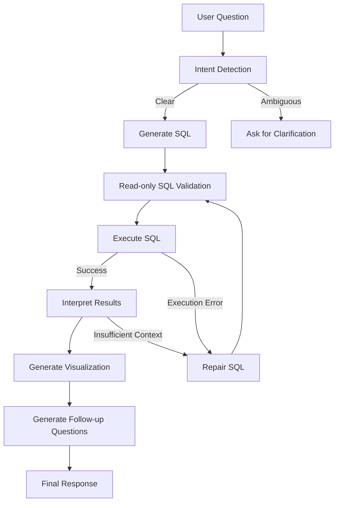
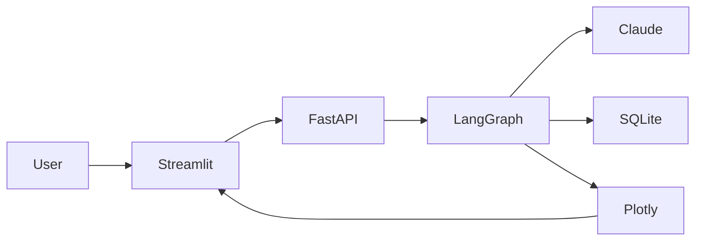

# askQL

<p align="center">
  <h3 align="center">🧠 AI-Powered Natural Language SQL Analytics Agent</h3>
  <p align="center">
    Translate plain English into production-safe SQL, execute it against structured data, visualize results, and receive grounded business insights.
  </p>
</p>

<p align="center">


</p>

---

## 🚀 Overview

**askQL** is an AI-powered analytics assistant that converts natural language into executable SQL using an agentic workflow built with **LangGraph**.

Unlike traditional NL→SQL demos, askQL doesn't stop after generating SQL.

It validates queries, automatically repairs failures, executes them safely against a read-only database, verifies whether sufficient information was retrieved, generates business-friendly explanations, visualizes results, and suggests intelligent follow-up questions.

The architecture is intentionally modular so each reasoning step can be inspected, replaced, or extended independently.

---

## ✨ Features

* 🧠 Natural Language → SQL generation
* 🔄 Self-healing SQL repair loop
* 🛡️ Read-only SQL safety validation
* ✅ Grounded business reasoning
* 📊 Automatic chart generation
* 💬 Conversational memory
* 📂 CSV & Excel upload support
* 🏗️ Dynamic schema discovery
* 📈 Business-friendly explanations
* 💡 Suggested follow-up questions
* 🔍 SQL transparency & execution details
* ⚡ FastAPI REST backend
* 🎨 Interactive Streamlit frontend

---

# 🏗 Architecture



---

# ⚙️ System Overview



---

# 🔄 Agent Workflow

```text
User Question
      │
      ▼
Intent Detection
      │
      ▼
Generate SQL
      │
      ▼
Validate SQL (Read-only)
      │
      ▼
Execute Query
      │
      ├─────────────── Success ─────────────────────┐
      │                                             │
      ▼                                             │
Interpret Results                                   │
      │                                             │
      ▼                                             │
Grounding Validation                                │
      │                                             │
      ▼                                             │
Generate Visualization                              │
      │                                             │
      ▼                                             │
Generate Follow-ups                                 │
      │                                             │
      ▼                                             │
Return Response                                     │
                                                    │
                     Error                          │
                       │                            │
                       ▼                            │
                 Repair SQL ────────────────────────┘
```

---

# 🛠 Tech Stack

| Layer           | Technology    |
| --------------- | ------------- |
| Language        | Python 3.11   |
| Agent Framework | LangGraph     |
| LLM             | Claude Sonnet |
| Backend         | FastAPI       |
| Frontend        | Streamlit     |
| Database        | SQLite        |
| Visualization   | Plotly        |
| Data Processing | Pandas        |
| Prompting       | Anthropic SDK |

---

# 📂 Project Structure

```text
askQL/

├── app/
│   ├── config.py
│   ├── database.py
│   ├── graph.py
│   ├── llm.py
│   ├── nodes.py
│   ├── prompts.py
│   ├── security.py
│   └── state.py
│
├── data/
│
├── docs/
│   ├── architecture.png
│   ├── workflow.png
│   ├── demo.gif
│   └── screenshots/
│
├── main.py
├── streamlit_app.py
├── seed_db.py
├── requirements.txt
└── .env.example
```

---

# 🚀 Quick Start

Clone the repository

```bash
git clone https://github.com/yourusername/askQL.git

cd askQL
```

Create a virtual environment

```bash
python -m venv .venv

source .venv/bin/activate
```

Install dependencies

```bash
pip install -r requirements.txt
```

Create environment variables

```bash
cp .env.example .env
```

Add your Anthropic API key.

```text
ANTHROPIC_API_KEY=your_api_key_here
```

Seed the demo database

```bash
python seed_db.py
```

---

# ▶️ Running

Backend

```bash
uvicorn main:app --reload --port 8000
```

Frontend

```bash
streamlit run streamlit_app.py
```

---

# 🌐 API

| Endpoint       | Description                       |
| -------------- | --------------------------------- |
| POST `/ask`    | Ask questions in natural language |
| POST `/upload` | Upload CSV or Excel datasets      |
| GET `/schema`  | Retrieve current database schema  |

---

# 💬 Example Questions

* What was our revenue in Q2?
* Which invoices are still unpaid?
* Top campaigns by ROAS
* Which customers generated the highest revenue?
* Compare budget vs actual spend.
* Which campaigns exceeded their budget?
* Give me a finance summary.
* Which clients require follow-up?

---

# 🧩 Core Capabilities

| Capability             | Implementation                       |
| ---------------------- | ------------------------------------ |
| Natural Language → SQL | Prompt-engineered Claude + LangGraph |
| SQL Repair             | Automatic retry routing              |
| Grounding Validation   | Result-aware interpretation          |
| SQL Safety             | Read-only validator                  |
| Schema Discovery       | Runtime schema introspection         |
| Visualization          | Automatic Plotly chart selection     |
| Memory                 | Session-based conversational context |
| Multi-file Upload      | CSV/XLSX → SQLite                    |
| Follow-up Generation   | Context-aware suggestions            |

---

# 🔒 Safety

askQL includes a strict read-only SQL validator before any query reaches the database.

Blocked operations include:

* INSERT
* UPDATE
* DELETE
* DROP
* ALTER
* TRUNCATE
* CREATE
* Multiple SQL statements
* Non-SELECT queries

Only a single `SELECT` or `WITH` statement is permitted.

For production deployments, this should be combined with read-only database credentials for defense in depth.

---

# 🗺 Roadmap

## ✅ Current

* [x] Natural Language SQL
* [x] SQL Repair
* [x] Grounding Validation
* [x] Automatic Charts
* [x] Dynamic Uploads
* [x] Conversational Memory
* [x] Multi-file Support

## 🚧 Planned

* [ ] PostgreSQL
* [ ] MySQL
* [ ] Snowflake
* [ ] BigQuery
* [ ] Redis Session Store
* [ ] Vector Schema Retrieval
* [ ] Authentication & RBAC
* [ ] Audit Logs
* [ ] Dashboard Builder
* [ ] Scheduled Reports
* [ ] Multi-agent Architecture

---

# 🤝 Contributing

Contributions are welcome.

If you'd like to improve askQL, feel free to fork the repository, open an issue, or submit a pull request.

---

# 📜 License

This project is released under the MIT License.

---

<p align="center">

Built with ❤️ using **LangGraph • Claude • FastAPI • Streamlit • Plotly**

</p>
